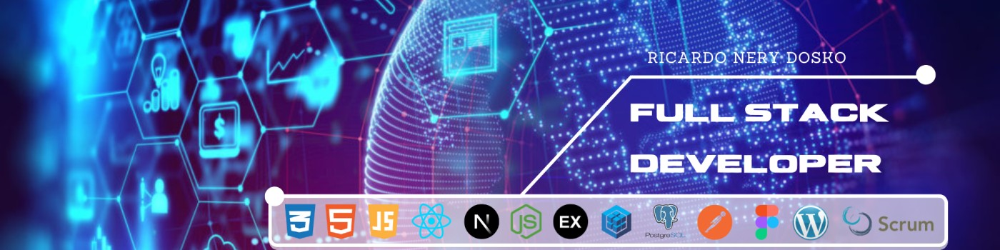

## Hola ,soy Ricardo Nery Dosko 👋

<h1>Sobre mi</h1>
<h2>Soy Técnico en Comunicación Multimedial con una profunda pasión por la tecnología y el desarrollo de software. Mi experiencia laboral en Syloper y mi formación en el Bootcamp de Henry me han permitido profundizar mis conocimientos y habilidades en desarrollo front-end y metodologías ágiles. Me adapto fácilmente a diversos entornos de trabajo y disfruto colaborando en equipos multidisciplinarios.
Además, mi formación en comunicación multimedial me ha brindado herramientas de marketing que me permiten entender y mejorar la venta de productos tecnológicos, con un enfoque en la automatización de procesos y la eficiencia. Estoy comprometido a seguir formándome en el desarrollo de software y herramientas relacionadas, impulsado por mi ambición de crecimiento continuo. Estoy entusiasmado por aplicar mis conocimientos y contribuir al desarrollo de soluciones innovadoras en una empresa dinámica.</h2>
 

<!--
**RicardoDosko/RicardoDosko** is a ✨ _special_ ✨ repository because its `README.md` (this file) appears on your GitHub profile.

Here are some ideas to get you started:

- 🔭 I’m currently working on ...
- 🌱 I’m currently learning ...
- 👯 I’m looking to collaborate on ...
- 🤔 I’m looking for help with ...
- 💬 Ask me about ...
- 📫 How to reach me: ...
- 😄 Pronouns: ...
- ⚡ Fun fact: ...
-->
